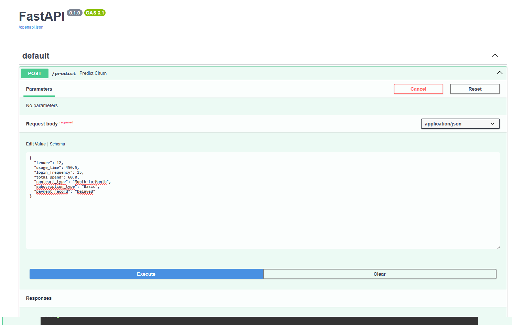
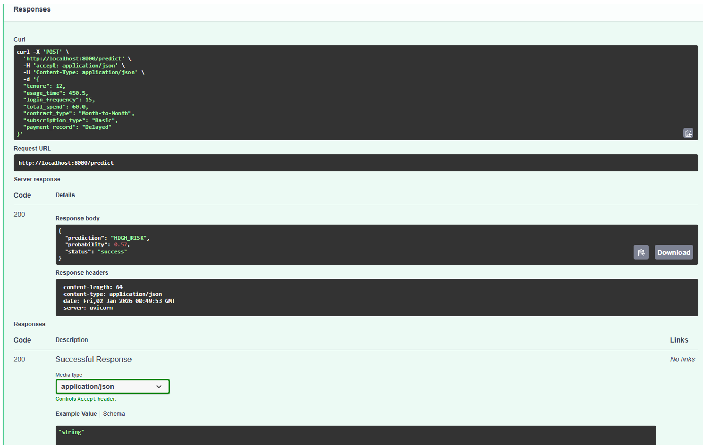

# 📊 Proyecto ChurnInsight: Predicción de Cancelación de Clientes

## 1. Descripción del Proyecto y Problemática

En el mercado actual de servicios por suscripción (Telecomunicaciones, SaaS, Fintech), la retención de clientes es crítica. El costo de adquirir un nuevo cliente puede ser hasta 5 veces mayor que retener a uno existente.

**El problema:** La empresa pierde clientes mes a mes sin aviso previo.
**La solución:** ChurnInsight. Un modelo de Machine Learning capaz de analizar patrones de comportamiento (pagos, uso, tipo de contrato) para predecir la probabilidad de abandono (_churn_).

Para este MVP, se han utilizado datos reales de **Orange Telecom**, procesados mediante un pipeline de ETL para simular un entorno empresarial real con datos de facturación, uso y demografía.

## 2. Diccionario de Datos (Variables Finales)

| Variable            | Descripción                                                | Tipo de Dato | Ejemplo                      |
| :------------------ | :--------------------------------------------------------- | :----------- | :--------------------------- |
| `customer_id`       | Identificador único del cliente (No se usa para predecir). | String       | "REAL-1001"                  |
| `tenure`            | Meses/Días de permanencia en la empresa.                   | Numérico     | 125                          |
| `contract_type`     | Tipo de contrato (Fidelidad).                              | Categórico   | "Two Year", "Month-to-Month" |
| `subscription_type` | Nivel de servicio contratado.                              | Categórico   | "Premium", "Basic"           |
| `usage_time`        | Minutos totales de uso del servicio.                       | Numérico     | 450.5                        |
| `login_frequency`   | Frecuencia de acceso/llamadas (Proxy de actividad).        | Numérico     | 15                           |
| `payment_record`    | Historial de pagos (Basado en reclamos).                   | Categórico   | "Delayed", "Good"            |
| `total_spend`       | Gasto total acumulado.                                     | Numérico     | 540.20                       |
| `churn`             | **Variable Objetivo**. ¿Canceló? (1=Sí, 0=No).             | Binario      | 0, 1                         |

## 3. Interfaz y ejemplos de respuesta

La API está expuesta en `http://127.0.0.1:8000` y la documentación interactiva en `/docs`.

Las siguientes imágenes muestran ejemplos del JSON de respuesta desde `http://127.0.0.1:8000/docs`:

- Respuesta ejemplo (imagen 1):

- Respuesta ejemplo (imagen 2):

> Nota: Si ejecutas el servidor localmente con `uvicorn app:app --reload`, abre [http://127.0.0.1:8000/docs](http://127.0.0.1:8000/docs) para ver y probar los endpoints.